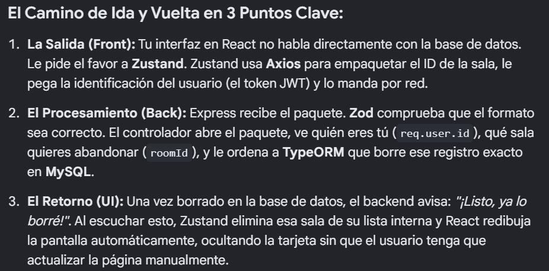

[ 💻 USUARIO ] 
      │
      ▼ (Hace clic en "Cancelar Participación" y confirma)
┌────────────────────────────────────────────────────────────────────────┐
│ 🟦 TARJETA FRONT: React (JavaScript)                                   │
│                                                                        │
│  [ RoomCard.jsx ] ──(Envía roomId)──> [ useRoomStore.js (Zustand) ]    │
└──────────────────────────────────────────────────────────────────┬─────┘
                                                                   │
                                           (Petición HTTP POST)    │  Axios añade el
                                    /api/rooms/cancel-participation│  Token JWT en las
                                                                   │  cabeceras.
                                                                   ▼
┌────────────────────────────────────────────────────────────────────────┐
│ 🟪 TARJETA BACK: Express + TypeScript                                  │
│                                                                        │
│  1. [ Express Router ] ───> Detecta la ruta elegida.                   │
│                                                                        │
│  2. [ Zod Middleware ] ───> Valida que el 'roomId' sea un número.      │
│                                                                        │
│  3. [ RoomController ] ───> Lee el 'req.user.id' del JWT y el          │
│                             'roomId' del cuerpo.                       │
│                                                                        │
│  4. [ TypeORM ] ──────────> Traduce la lógica a consultas SQL de       │
│                             forma segura.                              │
└──────────────────────────────────────────────────────────────────┬─────┘
                                                                   │
                                              (Consultas SQL)      │  Busca al participante
                                           SELECT / DELETE         │  y lo elimina si
                                                                   │  existe.
                                                                   ▼
┌────────────────────────────────────────────────────────────────────────┐
│ 🛢️ BASE DE DATOS: MySQL                                                │
│                                                                        │
│  [ Tabla 'participants' ] ───(Borra la fila de la unión)─────────┐     │
└──────────────────────────────────────────────────────────────────│─────┘
                                                                   │
                                                                   │ (Devuelve confirmación)
                                                                   ▼
┌────────────────────────────────────────────────────────────────────────┐
│ 🔄 RESPUESTA Y ACTUALIZACIÓN EN TIEMPO REAL                            │
│                                                                        │
│  1. El Servidor responde un estado: HTTP 200 OK.                       │
│  2. Zustand recibe el éxito y filtra el array de salas en memoria.     │
│  3. La tarjeta desaparece visualmente de la pantalla al instante.      │
└────────────────────────────────────────────────────────────────────────┘

==================================================================================================
1. 🟦 CAPA DE FRONTEND (React + Zustand + Axios)
==================================================================================================
 [ Usuario hace clic en "Cancelar participación" ]
       │
       ▼
 [ Componente React (SalaCard / SalaDetalle) ]
       │ ──> Dispara acción del estado global: `cancelarParticipacion(salaId)`
       ▼
 [ Store de Zustand (useSalaStore) ]
       │ ──> Cambia estado local a `loading: true` para feedback visual
       │ ──> Invoca cliente HTTP
       ▼
 [ Cliente Axios ]
       │ ──> Inyecta `Authorization: Bearer <JWT_TOKEN>` en los Headers
       │ ──> Envía solicitud HTTP: DELETE o POST a `/api/salas/:salaId/participantes`
       └───────────────────────────────────────┬──────────────────────────────────────────
                                               │
                                               ▼ [ Red / Petición HTTP ]
                                               │
==================================================================================================
2. 🟪 CAPA DE SEGURIDAD Y RUTAS (Express Router + JWT + Zod/Yup)
==================================================================================================
                                               │
       ┌───────────────────────────────────────┴──────────────────────────────────────────
       ▼
 [ Express Router ] ──> Captura el EndPoint `/api/salas/:salaId/participantes`
       │
       ▼
 [ Middleware: Auth (JWT) ] 
       │ ──> Extrae y verifica la firma del token. Si es válido, inyecta `req.user`
       ▼
 [ Middleware: Validación (Zod / Yup) ]
       │ ──> Valida que `salaId` sea un UUID/Entero válido en `req.params`
       │ ──> Valida que no vengan campos corruptos o malformados
       └───────────────────────────────────────┬──────────────────────────────────────────
                                               │ (Si todo es correcto)
                                               ▼
==================================================================================================
3. ⚙️ CAPA DE LÓGICA Y NEGOCIO (Express Controllers)
==================================================================================================
                                               │
       ┌───────────────────────────────────────┴──────────────────────────────────────────
       ▼
 [ SalaController.cancelarParticipacion ]
       │ ──> Extrae `salaId` de `req.params` y `usuarioId` de `req.user`
       │ ──> Aplica Reglas de Negocio:
       │     - ¿El usuario realmente está inscrito en esta sala?
       │     - ¿La sala sigue activa o ya finalizó/comenzó (bloqueo)?
       └───────────────────────────────────────┬──────────────────────────────────────────
                                               │ (Reglas de negocio aprobadas)
                                               ▼
==================================================================================================
4. 🗄️ CAPA DE PERSISTENCIA (TypeORM + MySQL)
==================================================================================================
                                               │
       ┌───────────────────────────────────────┴──────────────────────────────────────────
       ▼
 [ SalaParticipante Repository (TypeORM) ]
       │ ──> Ejecuta Query Builder / Active Record: `.delete({ salaId, usuarioId })`
       ▼
 [ Base de Datos (MySQL) ]
       │ ──> Transacción SQL: `DELETE FROM sala_participantes WHERE sala_id = X AND usuario_id = Y;`
       │ ──> MySQL confirma filas afectadas (1)
       ▼
 [ TypeORM ] ──> Retorna confirmación de éxito al Controlador
       └───────────────────────────────────────┬──────────────────────────────────────────
                                               │
                                               ▼ [ Retorno de la Información ]
                                               │
==================================================================================================
 RESPUESTA HTTP BACKEND ──> FRONTEND
==================================================================================================
                                               │
       ┌───────────────────────────────────────┴──────────────────────────────────────────
       ▼
 [ Express Controller ] ──> Envía HTTP 200 OK `{ success: true, message: "Participación cancelada", salaId }`
       │
       ▼
 [ Axios (Frontend) ] ──> Recibe la respuesta estructurada sin errores
       │
       ▼
 [ Store de Zustand (useSalaStore) ]
       │ ──> Modifica el array de salas o la sala actual en memoria (Inmutabilidad)
       │ ──> Remueve al usuario de la lista de participantes locales
       │ ──> Cambia estado a `loading: false`
       ▼
 [ Componente React ] ──> Detecta el cambio de estado de Zustand, se re-renderiza 
 [ Interfaz Actualizada ] ──> El botón vuelve a estar disponible como "Unirse a la sala" (UP-010)
--------------------------------------------------------------------------------------------------------------------
Frontend (Capa de Cliente)
React: La librería base de la interfaz de usuario. Se encarga de pintar los componentes (vistas de las salas, botones de acción) y reaccionar de forma eficiente a los cambios de estado.

Zustand: El motor de gestión de estado global. Es una alternativa ligera y moderna a Redux. Maneja la memoria caché del cliente, controla los estados de carga (loading) y distribuye los datos actualizados a los componentes de React.

Axios: El cliente HTTP encargado de realizar las peticiones asíncronas hacia el servidor. Se encarga de la comunicación (verbos REST como DELETE/POST) y de adjuntar automáticamente los tokens de seguridad a través de interceptores.

Backend (Capa de Servidor y API)
Node.js + Express (Express Router): El entorno de ejecución y el micro-framework que da vida al servidor. Express Router se encarga específicamente de la gestión de rutas (mapear la URL /api/salas/... hacia el código correspondiente).

JSON Web Tokens (JWT): El estándar de seguridad de la industria para la autenticación sin estado (stateless). Permite al backend saber qué usuario está operando sin necesidad de consultar la base de datos en cada middleware de ruta.

Zod / Yup: Librerías de validación de esquemas en tiempo de ejecución. Aseguran que los datos de entrada (como los parámetros de la URL o el cuerpo de la petición) cumplan estrictamente con los tipos de datos esperados antes de que pasen a la lógica de negocio.

Persistencia (Capa de Datos)
TypeORM: El ORM (Object-Relational Mapping) que actúa como puente entre el código orientado a objetos (JavaScript/TypeScript) y la base de datos relacional. Traduce funciones de código como .delete() a sentencias SQL nativas.

MySQL: El motor de base de datos relacional donde se almacena físicamente la información del negocio mediante tablas, llaves primarias y llaves foráneas (por ejemplo, la tabla intermedia sala_participantes).

🚀 2. ¿Cómo se puede mejorar? (Justificación Arquitectónica)El diseño actual es excelente para un MVP o una aplicación de mediana escala, pero presenta puntos de dolor si el proyecto crece en concurrencia (muchos usuarios usando el chat o las salas al mismo tiempo). Aquí tienes las mejoras clave para elevar la arquitectura a un nivel Enterprise:

A. Implementar Optimistic Updates (Actualizaciones Optimistas) en ZustandCómo funciona: En lugar de esperar a que el servidor responda HTTP 200 OK (lo cual puede tardar entre 200ms y 2 segundos dependiendo de la red), Zustand asume que la operación será exitosa y resta inmediatamente al participante en la interfaz. Si el servidor falla, se realiza un rollback (se vuelve al estado anterior) y se muestra un error.
Justificación: Mejora drásticamente la percepción de velocidad y la experiencia de usuario (UX). La interfaz se siente instantánea.

B. Migrar de Axios + Zustand (para datos del servidor) a TanStack Query (React Query)Cómo funciona: Dejar Zustand únicamente para el estado puramente local de la interfaz (como si un modal está abierto o cerrado) y delegar todo lo que viene de la base de datos a TanStack Query.
Justificación: React Query maneja de forma nativa e interna la expiración de caché, el auto-refresco de datos cuando el usuario vuelve a la pestaña, reintentos automáticos si falla la red, y simplifica enormemente las peticiones de mutación y el manejo de estados isLoading/isError. Reducirá drásticamente las líneas de código manuales en tus stores de Zustand.

C. Incorporar WebSockets (Socket.io) para Actualizaciones en Tiempo RealCómo funciona: Cuando el usuario "A" cancela su participación en la sala, el backend no solo le responde a él, sino que emite un evento por WebSockets a todos los demás usuarios conectados: "sala:participante_salio".
Justificación: Al ser una aplicación de "Salas" (donde visualmente dice 2/3 participantes), si otro usuario está mirando la pantalla, no verá el cambio de cupo a menos que recargue la página. Los WebSockets garantizan que toda la mesa de trabajo o lista de salas esté sincronizada en tiempo real para todos los usuarios.

D. Desacoplamiento de Lógica: Patrón de Servicios (Services)Cómo funciona: En la capa 3 (Express Controllers), se debe evitar que el controlador hable directamente con el repositorio de TypeORM. Se debe crear una sub-capas llamada SalaService. El controlador solo recibe la petición y llama a SalaService.removeParticipant(salaId, userId).
Justificación: Mantenibilidad y testeabilidad (Test-Driven Development). Facilita la creación de pruebas unitarias aisladas para la lógica de negocio sin depender de los objetos de petición (req) y respuesta (res) de Express.

