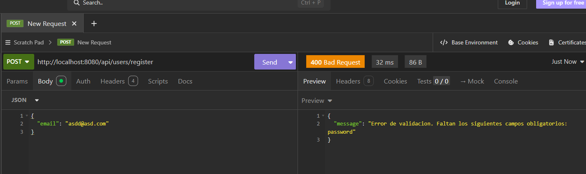
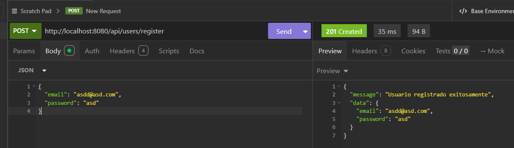
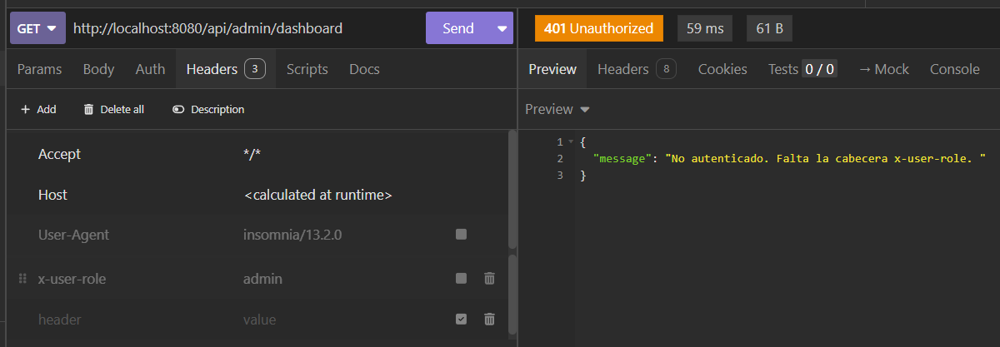
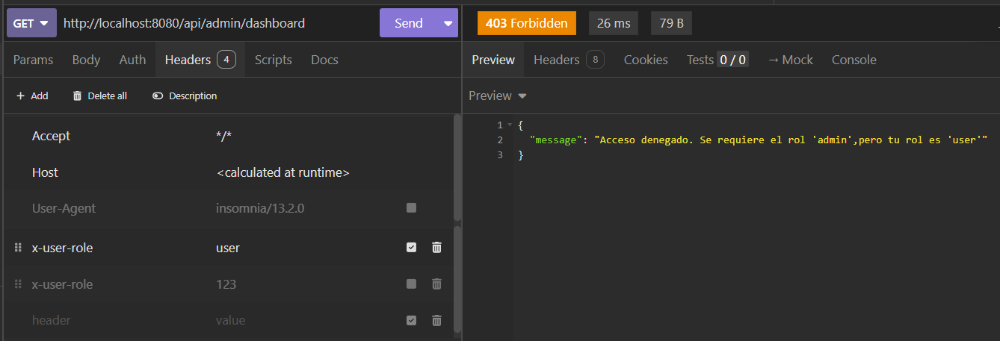
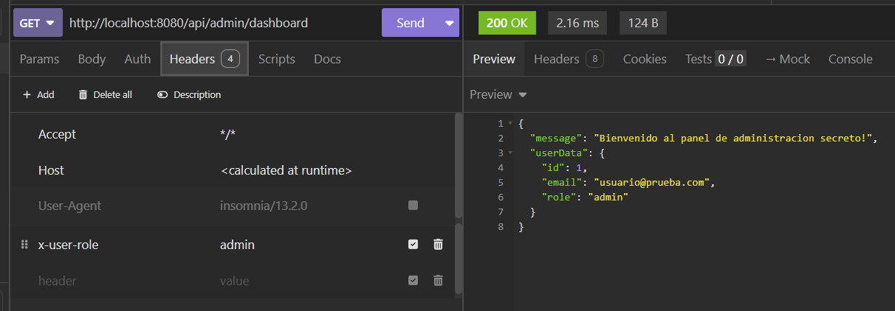
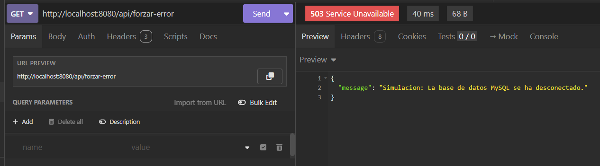
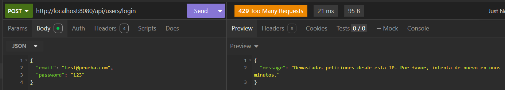

# Trabajo Práctico: Middlewares en Express con TypeScript

Este proyecto implementa y demuestra el uso de distintos tipos de middlewares en una API REST construida con **Node.js**, **Express** y **TypeScript**.

---

## Clasificación y Justificación de Middlewares

A continuación se detalla la clasificación teórica de cada middleware implementado (según la sección de clasificación por tipos) y la justificación de su nivel de aplicación en la app:

### 1. `validateBodyMiddleware`

- **Tipo teórica:** Middleware de nivel de ruta (Route-level middleware) / Middleware de validación de datos.
- **Nivel de aplicación:** Por ruta puntual.
- **Justificación:** Se aplica de forma individual en endpoints de creación (`POST /api/users/register` y `POST /api/products`) porque cada ruta requiere validar un conjunto distinto y específico de campos obligatorios en el cuerpo de la petición (`req.body`).

### 2. `requestLoggerMiddleware`

- **Tipo teórica:** Middleware de nivel de aplicación (Application-level middleware) / Middleware de registro (Logging).
- **Nivel de aplicación:** Global (`app.use`).
- **Justificación:** Se registra al inicio de la aplicación para interceptar, registrar (método HTTP, path y timestamp) y auditar absolutamente todas las peticiones entrantes que llegan al servidor, sin importar la ruta o el método utilizado.

### 3. `authorizeRoleMiddleware` y `authenticateSimuladoMiddleware`

- **Tipo teórica:** Middleware de autorización y autenticación / Nivel de ruta puntual o router.
- **Nivel de aplicación:** Por ruta puntual o grupo de rutas protegidas.
- **Justificación:** Se encadenan secuencialmente en endpoints que requieren permisos especiales (ej: `GET /api/admin/dashboard`). `authenticateSimuladoMiddleware` verifica la identidad y adjunta los datos del usuario en `req.user`, mientras que `authorizeRoleMiddleware` evalúa si dicho usuario tiene el rol necesario (`admin`).

### 4. `errorHandlerMiddleware`

- **Tipo teórica:** Middleware de manejo de errores (Error-handling middleware).
- **Nivel de aplicación:** Global (registrado obligatoriamente al final de todas las rutas).
- **Justificación:** Cuenta con una firma especial de 4 parámetros `(err, req, res, next)`. Se ubica después de todas las rutas para capturar de manera unificada cualquier excepción no controlada que se propague mediante `next(error)`, retornando siempre una respuesta JSON estándar con el código de estado correspondiente.

### 5. `rateLimiterMiddleware` (Desafío Opcional)

- **Tipo teórica:** Middleware de seguridad / Control de tráfico (Rate Limiting).
- **Nivel de aplicación:** Por ruta sensible (ej. `/api/users/login`).
- **Justificación:** Se aplica en rutas propensas a ataques de fuerza bruta o saturación. Mantiene un registro en memoria de las peticiones por dirección IP y bloquea aquellas que superen el límite máximo configurado en un rango de tiempo.

---

## Guía de Pruebas (INSOMNIA)

### 1. Validación de Body (`POST /api/users/register`)

- **Caso Rechazado (400 Bad Request):**
  - **Método:** `POST` | **URL:** `http://localhost:8080/api/users/register`
  - **Body (JSON):** `{ "email": "test@correo.com" }` _(falta `password`)_
  - **Respuesta:** `400 Bad Request` con el mensaje indicando que falta el campo `password`.
    
- **Caso Exitoso (201 Created):**
  - **Body (JSON):** `{ "email": "test@correo.com", "password": "123" }`
  - **Respuesta:** `201 Created` con confirmación de registro.
    

---

### 2. Autorización por Rol (`GET /api/admin/dashboard`)

- **Caso Rechazado 1 (401 Unauthorized - Sin Autenticar):**
  - **Método:** `GET` | **URL:** `http://localhost:8080/api/admin/dashboard` _(sin headers)_
  - **Respuesta:** `401 Unauthorized` indicando la falta de la cabecera `x-user-role`.
    
- **Caso Rechazado 2 (403 Forbidden - Rol Insuficiente):**
  - **Header:** `x-user-role: user`
  - **Respuesta:** `403 Forbidden` indicando acceso denegado por requerir el rol `admin`.
    
- **Caso Exitoso (200 OK):**
  - **Header:** `x-user-role: admin`
  - **Respuesta:** `200 OK` con la información del panel de administración.
    

---

### 3. Manejo de Errores (`GET /api/forzar-error`)

- **Prueba de Captura de Error:**
  - **Método:** `GET` | **URL:** `http://localhost:8080/api/forzar-error`
  - **Respuesta:** `503 Service Unavailable` con el JSON `{ "message": "Simulacion: La base de datos MySQL se ha desconectado." }`.
    

---

### 4. Rate Limiting (`POST /api/users/login`)

- **Caso Exitoso:** Realizar de 1 a 5 peticiones consecutivas enviando email y password.
- **Caso Bloqueado (429 Too Many Requests):** Realizar la 6ª petición dentro del mismo minuto.
  - **Respuesta:** `429 Too Many Requests` indicando que se ha superado el límite de peticiones desde esa IP.
    
